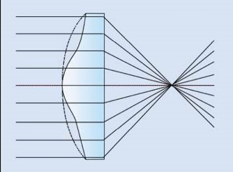
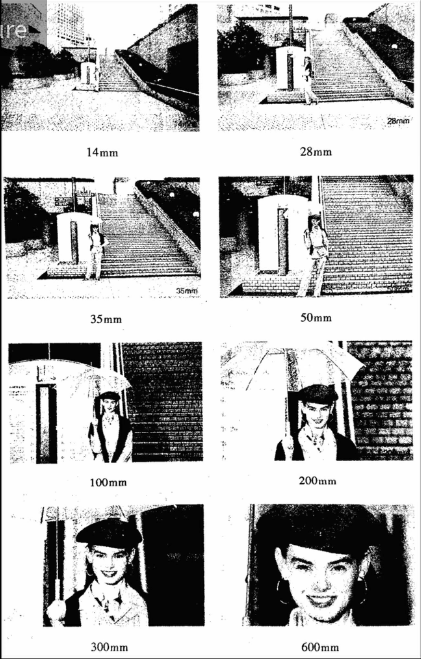
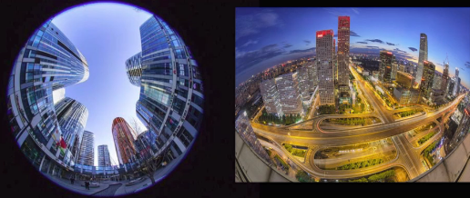
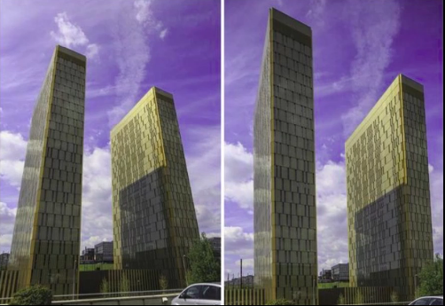
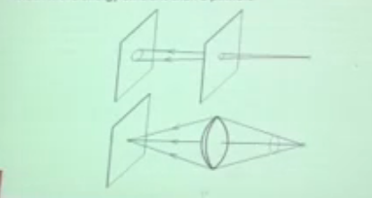
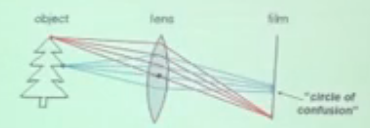
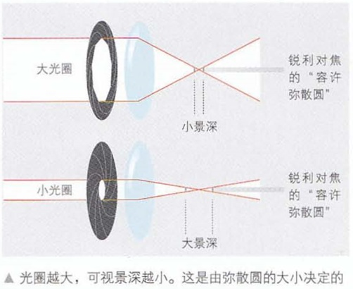
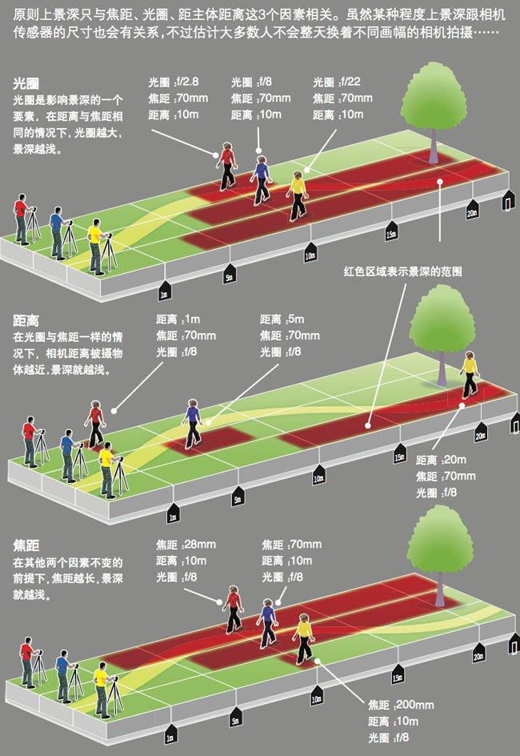
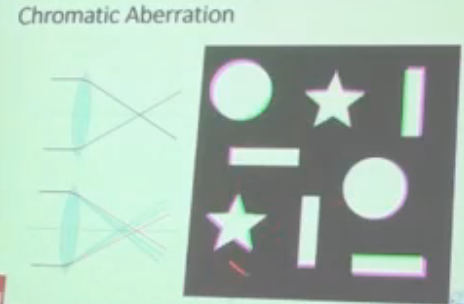

## 镜头：
#### 透镜：

* 凸/ 凹透镜（中间部分比两端窄）

  头镜片组：多片透镜减弱相差

  > 片：透镜总片数

  > 组，单独一片为一组，多片粘合在一起为一组

* 球面/非球面透镜

  球面透镜：从透镜中心到周边曲率不变（半径不变）

  非球面透镜：曲率连续变化（成像质量更好，可以克服像差）

* 萤石透镜/放射性透镜

  萤石透镜：氟化钙结晶后制成，成像更清晰明朗色彩更鲜明

  放射性透镜:上世纪镜头，氧化钍，有放射性

### 镀膜

镀膜可以提高透光度

### 焦距

* 镜头中心到胶片平面的距离（mm）

  > 焦距与视角成反比
  >
  > 焦距与景深（纵向景物清晰度）成反比

> 大焦距拉近物体，可视范围减小，被摄主体突出背景虚化

### 口径

* 镜头最大进光口，镜头的最大光圈
$$
口径=\frac{最大光孔直径}{焦距}
$$

> 一只50mm焦距、最大进光口直径为25mm的镜头，口径为25：50=1：2，记作F2
* F后系数越小，口径越大
* 大口径在弱光条件下依然可以手持相机用现场光拍摄：大口径单位时间进光量大，到达成相平面快，所需拍摄时间短，手的抖动造成的影响更小

* 大口径便于获取小景深以达到虚实结合的效果
* 大口径可以使用较快的快门速度，利于拍摄运动物体

### 镜头分类

* 标准镜头(定焦)

  > 焦距$$\approx $$ |相机画幅对角线|

  > 这类镜头焦距不同，但成像视角$$\approx$$ 人眼视角

* 广角与超广角镜头

  > 焦距短，视角大，景深大，透视感强
  >
  > 影像边缘畸变大，像差大
  >
  > 135相机：焦距30mm左右，视角$$70^\circ$$左右为广角
  >
  > ​                     焦距22mm左右，视角$$90^\circ$$左右为超广角
  >
  > ​                     焦距16mm以下，视角$$180^\circ$$左右为鱼眼镜头，                          可以产生圆形影像和矩形影像

* 长焦镜头(远射镜头/超远射镜头)

  >焦距长，视角小，景深小，影像畸变小，像差小
  >
  >适合风景、人像、野生动物、体育运动
  >
  >135相机：焦距200mm左右，视角$$10^\circ$$左右为远射
  >
  >​                     焦距300mm以上，视角$$8^\circ$$以下为超远射
  >
  >​                    焦距500mm和1000mm会做成反射式镜头，以减少镜头的长度，更轻便；缺点是通常只有一档光圈

* 变焦镜头

  手动/自动变焦

  变焦范围：

  > 广角:20-40mm    标准:35-70mm   中远:70-210mm   远射:200-400mm

  变焦倍率：$$倍率=\frac{最长焦距}{最短焦距}$$

  变焦方式：单环推拉式，推拉变焦，转动对焦

  ​                      双环转动式，变焦对焦为各自独立的转动环 

* 特殊镜头

  微距镜头：可以产生巨像效果
  
  ​                      专用型只用于近摄，焦距越短，放大倍率越大，结合近摄筒或近摄皮腔使用
  
  ​                      通用型可以 近摄，也可以远射，但放大倍率低
  
  柔焦镜头：使影像轻度虚化
  
  ​					  用一个清晰实像和一个焦点不准的虚像产生双重影像
  
  移轴镜头：透视调整镜头，也叫蛇腹镜头
  
  ​					 能校正高大建筑物的垂直线收缩功能
  
  

 

* 相机为什么使用透镜而不是针孔相机模型？

  > 孔大导致成像模糊，孔过小，通过的光少需要长时间曝光。
  >
  > 透镜可以将同一点发出的光线聚焦，减少曝光时间。

* 凸透镜 的特点：距离透镜特定距离的点光源才能聚焦到像平面，其余位置的点光源在像平面上投影为一个弥撒圆（circle of confusion）,弥撒圆越小成像越锐利

  

  > 手机相机中聚焦不同的对象的方式是，通过调整手机成相平面让选中对象的锐度尽可能高

* aperture controls depth of field

  景深为在焦点前后"容许弥撒圆"范围内的景物的深度

  

  > (note: 这幅图有瑕疵，光通过透镜后不是平行的，会聚焦)
  
* 不固定构图时，影响景深的因素：光圈，焦距，物距，画幅

* field of view (zoom)视野

  fov越大，成像越接近于perspective project

  fov越小，成像越接近于orthogonal project

（50mm透镜拍人像，fov过大会大鼻子，fov过小人脸扁）

* lens flaws: chromatic aberration

  dispersion : wavelength-dependent reflective index(折光率)

  在凸透镜上叠加其他透镜来减少这个现象

